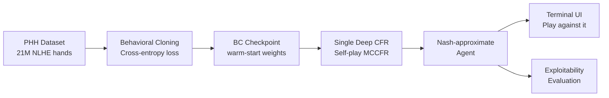

# HUNL Poker Agent

A Heads-Up No-Limit Texas Hold'em poker AI built with **Behavioral Cloning → Single Deep CFR**.

## What is this?

Texas Hold'em poker is an **imperfect-information game**: players can't see each other's cards. Unlike chess or Go (perfect information), optimal play requires a **mixed strategy** — sometimes bluffing, sometimes folding strong hands to avoid being exploitable.

The goal is to approximate a **Nash equilibrium**: a strategy where neither player can improve their expected outcome by deviating. At Nash equilibrium, the agent is unexploitable by any opponent strategy.

## Why this approach?

Two techniques combined outperform either alone:

1. **Behavioral Cloning (Phase 1):** Supervised learning on 21M real human NLHE hand histories. Trains the network to imitate strong human players. This gives the agent basic poker structure — don't fold aces preflop, don't call off your stack with 7-2 offsuit. Fast to train, but limited to human-level mistakes.

2. **Single Deep CFR (Phase 2):** Counterfactual Regret Minimization self-play. The agent plays millions of hands against itself, accumulating regret for suboptimal decisions, and converges toward Nash equilibrium. BC weights initialize this phase, dramatically cutting the iterations needed.



**Key novelty:** The BC warm-start is used to initialize the *advantage network* — the same network that estimates counterfactual regrets in CFR. This is not standard imitation learning; it's a curriculum that uses human data to bootstrap game-theoretic self-play.

## Results

| Agent | vs Random (bb/100) | Exploitability (mbb/h) |
|---|---|---|
| Random baseline | — | — |
| BC only | TBD | TBD |
| BC + SD-CFR (quick, 100 iter) | TBD | TBD |
| BC + SD-CFR (full, 500 iter) | TBD | TBD |

*(Fill in after training)*

## Reproducing Results

### 1. Setup

```bash
git clone https://github.com/TerminalRocketship45/PokerBot
cd PokerBot/RohanPoker
conda env create -f environment.yml
conda activate poker_agent
```

### 2. Download datasets

See `data/download_instructions.md`.

### 3. Preprocess

```bash
python scripts/preprocess_phh.py
python scripts/preprocess_irc.py  # optional, auto-skipped if <100K NLHE hands
```

### 4. Verify Phase 0 (core correctness gate)

```bash
pytest tests/test_core.py -v
```

All 6 checks must pass before training.

### 5. Train Phase 1 (Behavioral Cloning)

```bash
python scripts/train_phase1_bc.py
```

Target: >40% validation accuracy.

### 6. Train Phase 2 (SD-CFR)

```bash
# Quick run (~6 hours, CPU)
python scripts/train_phase2_sdcfr.py --config quick --bc_checkpoint checkpoints/bc_final.pt

# Full run (~40 hours, CPU)
python scripts/train_phase2_sdcfr.py --config full --bc_checkpoint checkpoints/bc_final.pt
```

### 7. Evaluate

```bash
python scripts/evaluate.py --checkpoint checkpoints/iter_0100.pt
```

### 8. Play against the agent

```bash
python src/ui/play.py --checkpoint checkpoints/iter_0100.pt
```

## Project Structure

```
RohanPoker/
├── src/
│   ├── env/          # OpenSpiel wrapper, action abstraction
│   ├── data/         # Encoder, parsers, BC dataset
│   ├── models/       # AdvantageNet (shared for BC + CFR)
│   ├── cfr/          # Regret matching+, reservoir buffer, MCCFR traversal, SD-CFR
│   ├── bc/           # BC training + validation
│   ├── eval/         # Exploitability, H2H, metrics
│   └── ui/           # Terminal UI
├── configs/          # quick.yaml, full.yaml training presets
├── scripts/          # Preprocessing + training entry points
├── tests/            # test_core.py (Phase 0 gate) + unit tests
└── data/             # Raw + processed datasets (gitignored)
```

## References

1. [Deep CFR](https://arxiv.org/abs/1811.00164) — Brown et al. 2018
2. [Single Deep CFR](https://arxiv.org/abs/1901.07621) — Steinberger 2019
3. [Coherent Soft Imitation Learning](https://arxiv.org/abs/2305.16498) — BC→RL transition theory
4. [OpenSpiel](https://github.com/google-deepmind/open_spiel) — game environment
5. [PHH Dataset](https://zenodo.org/records/13997158) — 21M NLHE hand histories
